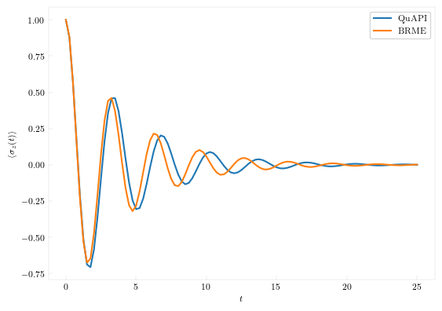

# Bloch-Redfield Master Equation

QuantumDynamics also offers the option of simulating the dynamics of an open quantum system using the Bloch-Redfield equations. The main interface is similar to that of the path integral-based methods except for the crucial difference that instead of building on the forward-backward propagator, the Bloch-Redfield Master Equations (BRME) uses the Hamiltonian.

First, we define the system and the spectral density describing the solvent
```julia
using QuantumDynamics

H0 = Utilities.create_tls_hamiltonian(; ϵ=0.0, Δ=2.0)        # 1.1 Define the system Hamiltonian
Jw = SpectralDensities.ExponentialCutoff(; ξ=0.1, ωc=7.5)    # 1.2 Define the spectral density
β = 5.0    # 1.3 Inverse temperature
dt = 0.25
ntimes = 100
ρ0 = [1.0+0.0im 0; 0 0]
```

The interface to BRME is provided in the Bloch-Redfield module as the propagate function.
```julia
time, ρs = BlochRedfield.propagate(; Hamiltonian=H0, Jw=[Jw], β, ρ0, dt, ntimes, sys_ops=[[1.0+0.0im 0.0; 0.0 -1.0]])
```

Let's also do a QuAPI calculation for comparison:
```julia
fbU = Propagators.calculate_bare_propagators(; Hamiltonian=H0, dt=dt, ntimes=ntimes)
t, ρs_quapi = QuAPI.propagate(; fbU=fbU, Jw=[Jw], β=β, ρ0=ρ0, dt=dt, ntimes=ntimes, kmax=7)
```
