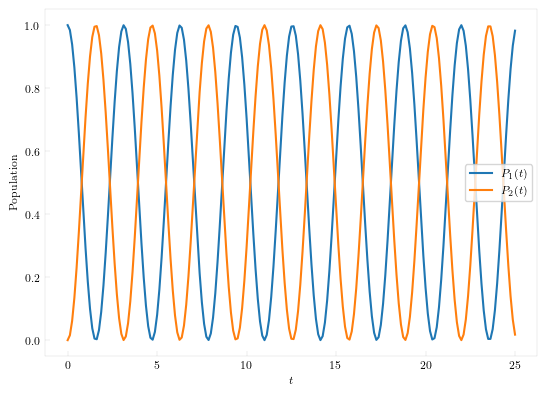
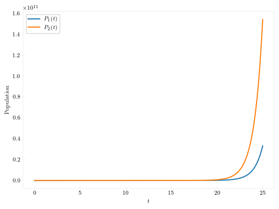

# Empirical Approaches

Before jumping into systematic solutions of the dynamics of open quantum systems, let us illustrate a couple of *ad-hoc* approaches to modeling such systems. The first approach considered here is the celebrated Linblad Master Equations. Thereafter, we also demonstrate how to use QuantumDynamics to simulate the dynamics corresponding to non-Hermitian systems.

For all the examples that are shown here, the following setup remains the same:
```julia
using QuantumDynamics
using Plots, LaTeXStrings

dt = 0.125
ntimes = 200

ρ0 = [1.0+0.0im 0.0; 0.0 0.0]
```
We are using a time-step of ``0.125`` and simulating for ``200`` time steps. We start the simulation from an initial condition localized on one of the states.

## Bare Hermitian System

The Hermitian Hamiltonian considered here is:
```julia
H = Utilities.create_tls_hamiltonian(; ϵ=0.0, Δ=2.0)
```
Now we solve Heisenberg's equation of motion for the reduced density matrix:
```julia
times, ρs = Bare.propagate(; Hamiltonian=H, ρ0, dt, ntimes);
```



## Lindblad Master Equation
The same interface can be used to solve the Lindblad Master Equation by providing an array of non-Hermitian dissipative *collapse* operators, `L`.
```julia
L = [[0.0+0.0im 0; 0.75 0]]
times, ρs = Bare.propagate(; Hamiltonian=H, ρ0, dt, ntimes, L);
```


## Non-Hermitian System
Dynamics described by non-Hermitian systems is heavily dependent on the type of non-Hermitian term. Consider an arbitrary non-*PT*-symmetric non-Hermitian Hamiltonian.
```julia
H = [exp(-1.5im) -0.75; -0.75 exp(0.75im)]
datum = (H[1,1]+H[2,2])/2
H[1,1] -= datum
H[2,2] -= datum
```
The dynamics is simulated in a way that is identical to that of the bare Hermitian system.
```julia
times, ρs = Bare.propagate(; Hamiltonian=H, ρ0, dt, ntimes);
plot(times, real(ρs[:,1,1]), label=L"P_1(t)", lw = 2)
plot!(times, real(ρs[:,2,2]), label=L"P_2(t)", lw = 2)
xlabel!(L"t")
ylabel!("Population")
```

