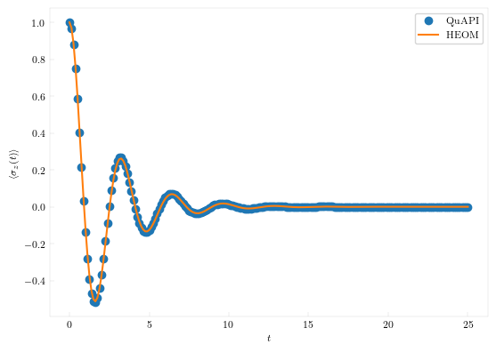

# Hierarchical Equation of Motion

The HEOM family of methods is an extremely popular set of methods for solving the system-harmonic bath problem. While exact like QuAPI, its initial formulation was efficient for the Ohmic spectral density with a Drude-Lorentz cutoff. While a lot of significant work has gone into improving the performance of the method, and increasing the generality, the implementation in QuAPI is currently quite basic and can only handle Drude spectral densities.

TO propagate an initial reduced density matrix using HEOM, we define a Hamiltonian and specify the spectral density and the temperature. Unlike QuAPI, HEOM can incorporate baths interacting with the system through non-diagonal operators without any increase in the complexity of the algorithm. However, for comparison purposes, in this tutorial, we restrict our attention to diagonal system-bath couplings.

```julia
using QuantumDynamics
using Plots, LaTeXStrings

H0 = Utilities.create_tls_hamiltonian(; ϵ=0.0, Δ=2.0)        # 1.1 Define the system Hamiltonian
ρ0 = [1.0+0.0im 0; 0 0]
β = 0.5
Jw = SpectralDensities.DrudeLorentz(; λ=1.5, γ=7.5)
dt = 0.125
ntimes = 200
```

We call the `propagate` function
```julia
times_HEOM, ρs_HEOM = HEOM.propagate(; Hamiltonian=H0, ρ0, β, dt, ntimes, Jw=[Jw], sys_ops=[[1.0+0.0im 0.0; 0.0 -1.0]], num_modes=1, Lmax=2)
```

For comparison, we also simulate the system using QuAPI and plot the results.
```julia
barefbU = Propagators.calculate_bare_propagators(; Hamiltonian=H0, dt, ntimes);
times, ρs = TEMPO.propagate(; fbU=barefbU, Jw=[Jw], β, ρ0, dt, ntimes, kmax=10)
```

