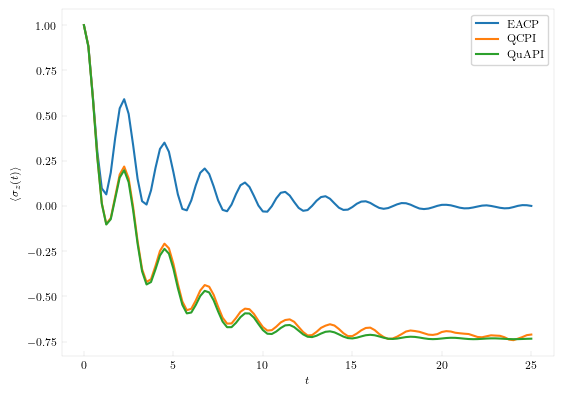

# Quantum-Classical Path Integral (QCPI)

QCPI is a numerically exact method for simulating a quantum system interacting with a large thermal environment. This environment is described through force-fields or *ab initio* molecular dynamics trajectories. While the Gaussian response results are often very good, it is an exciting prospect to be able to solve the full atomistic problem. Here, we implement the harmonic-backreaction (HBR) version of QCPI, which charts a middle-ground between the solution to the fully atomistic problem and the fully harmonic problem. In HBR, the full anharmonicity of the solvent is taken into account in the classical temperature-dependent part of the memory. The quantum, temperature-independent part of the memory is dealt with harmonically.

In QuantumDynamics.jl, QCPI is a wrapper around other base path integral methods like QuAPI, TNPI, or Blips. So, we automatically get standard HBR-QCPI (a combination QCPI with QuAPI), blip HBR-QCPI (a combination of QCPI with blips) and HBR-TNPI (a combination of QCPI with TNPI) based on the "backend" used.

## Example
The basic simulation starts in a manner that should familiar from the setup of a QuAPI or TNPI simulation.

```julia
using QuantumDynamics
using Plots, LaTeXStrings

H0 = Utilities.create_tls_hamiltonian(; ϵ=2.0, Δ=2.0)        # 1.1 Define the system Hamiltonian
ρ0 = [1.0+0.0im 0.0; 0.0 0.0]
β = 5.0
dt = 0.25
ntimes = 100
```

Right now QCPI only supports harmonic solvents, but it is possible to code up generic atomistic solvents or simply provide adapters for packages like Molly.jl or DFTK.jl. So, let's define the harmonic bath and discretize it into 100 oscillators for the classical trajectories.
```julia
Jw = SpectralDensities.ExponentialCutoff(; ξ=0.1, ωc=7.5)    # 1.2 Define the spectral density
ω, c = SpectralDensities.discretize(Jw, 100)
hb = Solvents.HarmonicBath(β, ω, c, [1.0, -1.0], 100);
```
`SpectralDensities.discretize` discretizes a given spectral density into oscillators. Then we create a `Solvents.HarmonicBath` bath at the given inverse temperature, with the frequencies and couplings. The last two arguments to `Solvents.HarmonicBath` are the system operator along which the solvent acts and the number of initial conditions that would be sampled. How the solvent samples the phase-space is dependent on the particular implementation. For a harmonic bath, one can simply sample the multidimensional Gaussian distributions. For molecular solvents, one can implement molecular dynamics trajectories with a thermostat.

One can generate the ensemble averaged classical path result, which contains only the real part of memory. This involves generating the correct propagators and using them to propagate an initial reduced density matrix.
```julia
EACP_fbU = Propagators.calculate_average_reference_propagators(; Hamiltonian=H0, solvent=hb, classical_dt=dt/100, dt, ntimes);
times_EACP, ρs_EACP = Utilities.apply_propagator(; propagators=EACP_fbU, ρ0, ntimes, dt);
```

For a full QCPI calculation, we use the `propagate` interface:
```julia
times_QCPI, ρs_QCPI = QCPI.propagate(; Hamiltonian=H0, Jw, solvent=hb, ρ0, classical_dt=dt/100, dt, ntimes, kmax=3, extraargs=QuAPI.QuAPIArgs(), path_integral_routine=QuAPI.propagate)
```

Lastly, we run a TTM-QuAPI simulation for comparison and plot the results.
```julia
fbU = Propagators.calculate_bare_propagators(; Hamiltonian=H0, dt, ntimes);
@time times, ρs = TTM.propagate(; fbU=fbU, Jw=[Jw], β, ρ0, dt, ntimes, rmax=5, extraargs=Blip.BlipArgs(), path_integral_routine=Blip.build_augmented_propagator_QuAPI_TTM)
```

